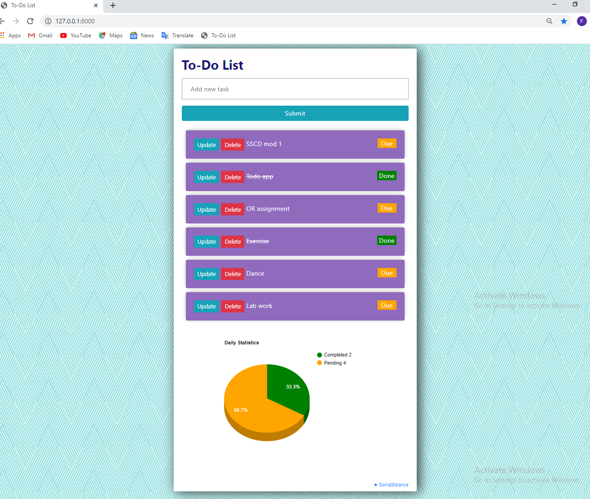

# Read me
### Simple To-Do List that performs basic CRUD operations, created using the Python Web Framework- Django 3.0, HTML ,CSS and Interactive Google Charts

# Requirements
* **Python 3.0 or higher**
* **Django 3.0**

# Run
> **python manage.py runserver**

For detailed steps checkout [**readme.txt**](https://github.com/SoniaStalance/To-do-list/blob/master/readme.txt)

# Build from Scratch
Follow steps in [**steps_build_from_scratch.txt**](https://github.com/SoniaStalance/To-do-list/blob/master/steps_build_from_scratch.txt)

# Learn More
#### Django Documentation https://docs.djangoproject.com/en/3.0
#### Google Charts        https://developers.google.com/chart
